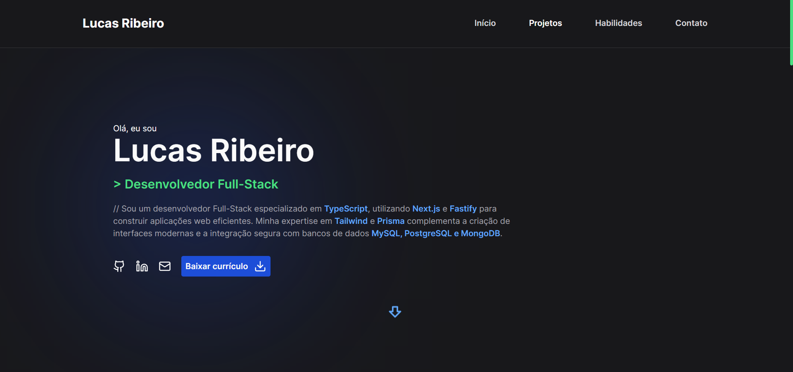

# Portfolio - Lucas Ribeiro



## 🚀 Visão Geral

Bem-vindo ao meu portfólio! Esse projeto foi feito com o intuito de me apresentar como dev e mostrar meus projetos feitos ao longo dos meus estudos.

## 🛠️ Tecnologias Principais

- **Framework Frontend:** Next.js
- **Linguagem de Programação:** TypeScript
- **Estilização:** Tailwind CSS
- **Validação de Dados:** Zod
- **Ícones:** Lucide
- **Animações:** Framer Motion
- **Componentes:** Radix UI

## 📁 Clonando e Rodando o Projeto

Para clonar e rodar este projeto localmente, siga estas etapas:

1. **Clonar o Repositório:**

   Abra o terminal ou prompt de comando e navegue até o diretório onde deseja clonar o projeto. Em seguida, execute o seguinte comando para clonar o repositório:

   ```bash
   git clone https://github.com/lucasadsr/portifolio.git
   ```

2. **Instalar Dependências:**

   Navegue até o diretório do projeto clonado usando o comando cd. Uma vez dentro do diretório do projeto, instale as dependências necessárias executando:

   ```bash
   npm install
   ```

3. **Rodar o Projeto:**

   Após a instalação das dependências, você pode iniciar o servidor de desenvolvimento. Execute o seguinte comando:

   ```bash
   npm run dev
   ```