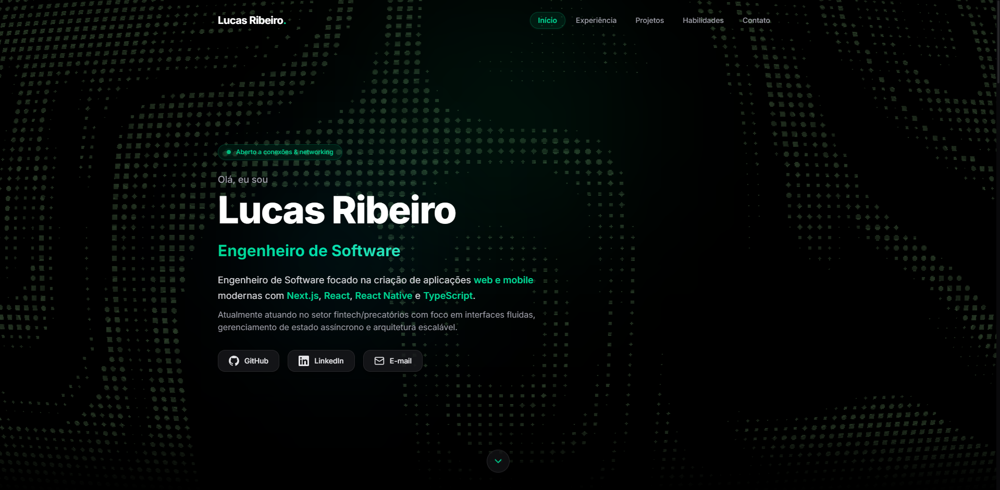

# ✨ Lucas Ribeiro — Developer Portfolio

<div align="center">


<br />



</div>

---

## 📌 Sobre o Portfólio

Este repositório reúne meu portfólio pessoal de desenvolvimento — uma aplicação web moderna projetada para apresentar minhas experiências, projetos e habilidades técnicas através de uma **interface rica, fluida e altamente interativa**.

O objetivo principal deste projeto é unir excelência em engenharia de software com design gráfico de alta qualidade, proporcionando uma experiência de navegação marcante para visitantes, recrutadores e desenvolvedores.

---

## 🎨 Destaques de UI/UX & Experiência Visual

- **💎 Estética Dark Mode Elegante:** Layout moderno projetado com paletas de cores refinadas, excelente contraste e foco na legibilidade.
- **⚡ Animações & Micro-interações Fluidas:** Transições suaves impulsionadas por **Motion (Framer Motion)** e **GSAP**, tornando a navegação dinâmica e responsiva.
- **🃏 Navegação de Projetos com CardSwap:** Sistema interativo de troca de cards para visualização intuitiva dos trabalhos desenvolvidos.
- **⌨️ Identidade Visual Customizada:** Favicon e detalhes visuais exclusivos inspirados em keycaps mecânicas 3D e elementos retro/cyberpunk.
- **📱 Responsividade Total:** Design adaptável com suporte completo a múltiplos tamanhos de tela (mobile, tablet e desktop).

---

## 🚀 Estrutura & Seções

- **Hero & Apresentação:** Introdução com status de disponibilidade profissional e chamadas para ação.
- **Trajetória & Experiência:** Linha do tempo descrevendo marcos de carreira e histórico profissional.
- **Galeria de Projetos:** Exposição de projetos reais com links de código-fonte, demonstração ao vivo e tecnologias utilizadas.
- **Matriz de Habilidades:** Organização categórica de competências (Frontend, Backend, Ferramentas e Design).
- **Contato Direto:** Formulário integrado com validação em tempo real e atalhos para redes profissionais.

---

## 🛠️ Ecossistema Tecnológico

| Categoria | Tecnologias Utilizadas |
| :--- | :--- |
| **Core Framework** | Next.js 16 (App Router), React 19, TypeScript |
| **Estilização & UI** | Tailwind CSS v4, Radix UI Primitives, Lucide Icons |
| **Animações & Graphics** | Motion (Framer Motion), GSAP, OGL (WebGL) |
| **Formulários & Validação** | React Hook Form, Zod Resolver |

---

## 💻 Executando Localmente

Caso queira explorar o código-fonte ou rodar o projeto na sua máquina:

```bash
# 1. Clone o repositório
git clone https://github.com/lucasadsr/portifolio.git

# 2. Acesse a pasta do projeto
cd portifolio

# 3. Instale as dependências
npm install

# 4. Inicie o servidor de desenvolvimento
npm run dev
```

Abra [http://localhost:3000](http://localhost:3000) no seu navegador para ver o resultado.

---

<div align="center">

Desenvolvido com 💜 por **Lucas Ribeiro**

</div>
